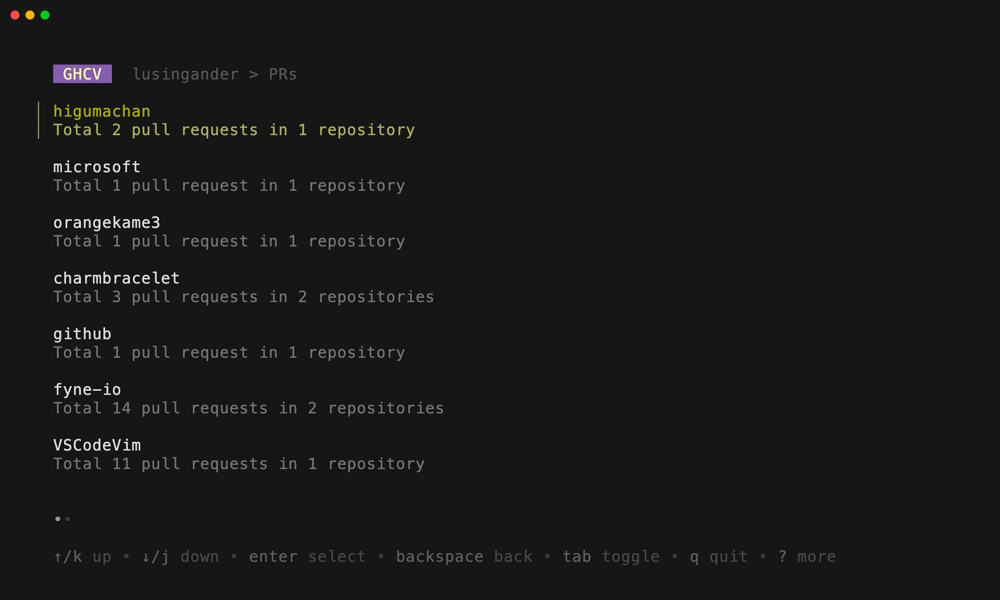
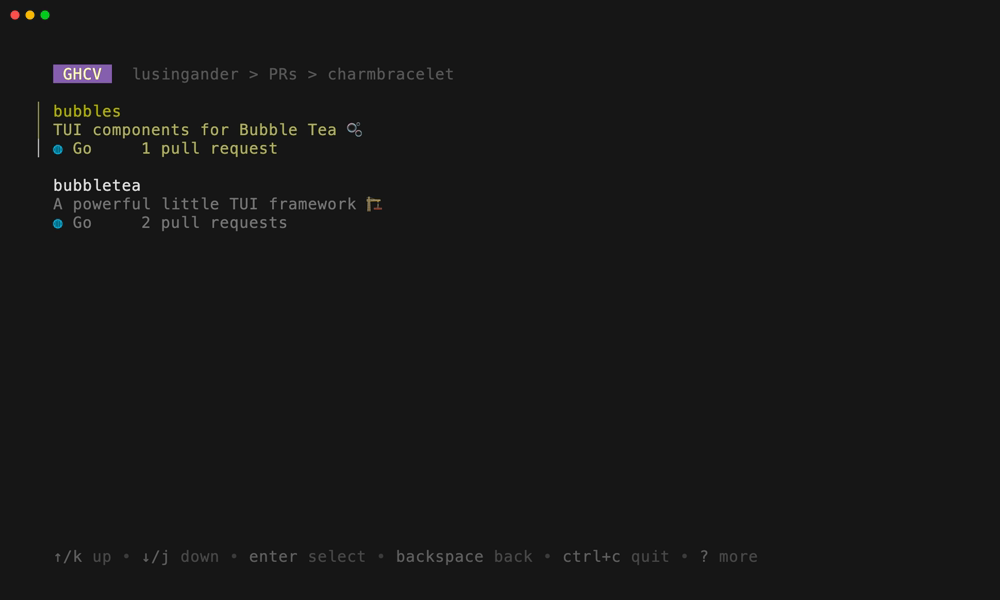
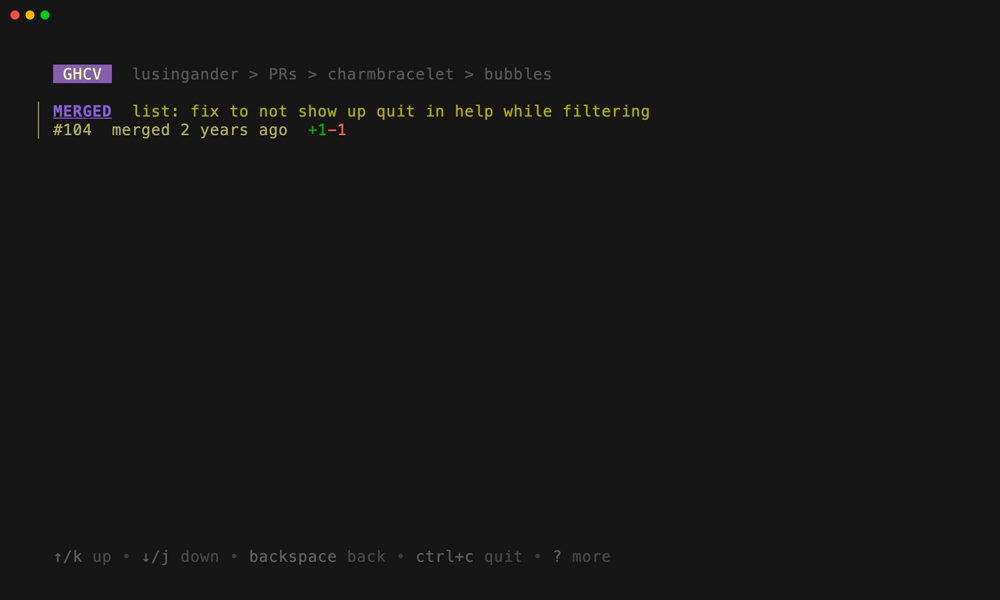
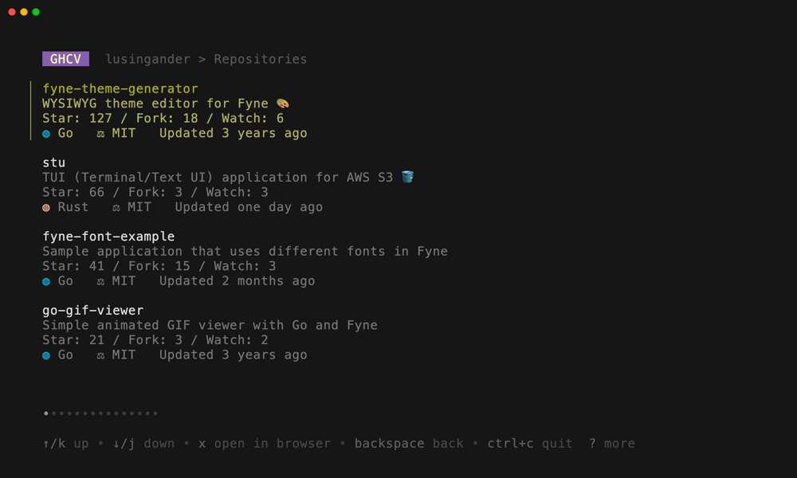

# ghcv-cli

ghcv-cli makes it easy to view the user-created issues, pull requests, and repositories in the terminal.


## About

- Show a list of pull requests created by the user (to other people's repositories)
- Show a list of (non-forked) public repositories created by the user

## Installation

`$ go install github.com/lusingander/ghcv-cli/cmd/ghcv@latest`

## Setup

You will need to authenticate with GitHub in order to use the application because GitHub GraphQL API [requires authentication](https://docs.github.com/en/graphql/guides/forming-calls-with-graphql#authenticating-with-graphql).

Authentication must be granted according to the [Device flow](https://docs.github.com/en/developers/apps/building-oauth-apps/authorizing-oauth-apps#device-flow). You will need to enter the code that will be displayed in your console when you start the application.

> The application requires only minimal scope (access to public information).

Or, you can set the [personal access token](https://docs.github.com/en/authentication/keeping-your-account-and-data-secure/creating-a-personal-access-token) as the environment variable.

```sh
export GHCV_GITHUB_ACCESS_TOKEN=<token>
```

> In this case as well, you don't need to specify anything in the scope (only public information will be accessed).

## Usage

### Pull Requests

You can list all pull requests created by the user (to the user's own repository are not included).
Pull requests are grouped and displayed by the target repository and its owner.

You can also view all pull requests without grouping and filter by status.






### Repositories

You can list all repositories created by the user.
Only public and not forked repositories will be shown.

By default, Repositories will be sorted by stars.
You can sort by number of stars and last updated.

You can also filter by language.




## License

MIT
